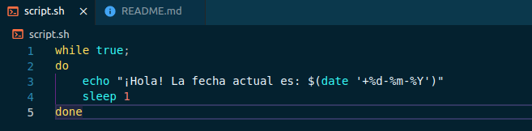
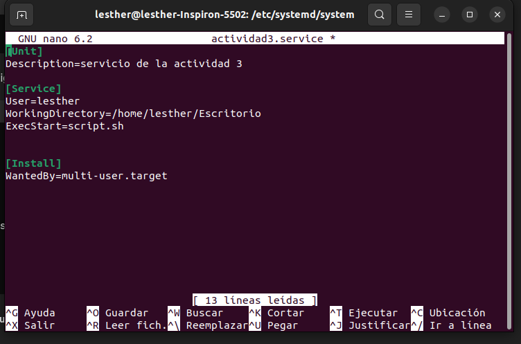
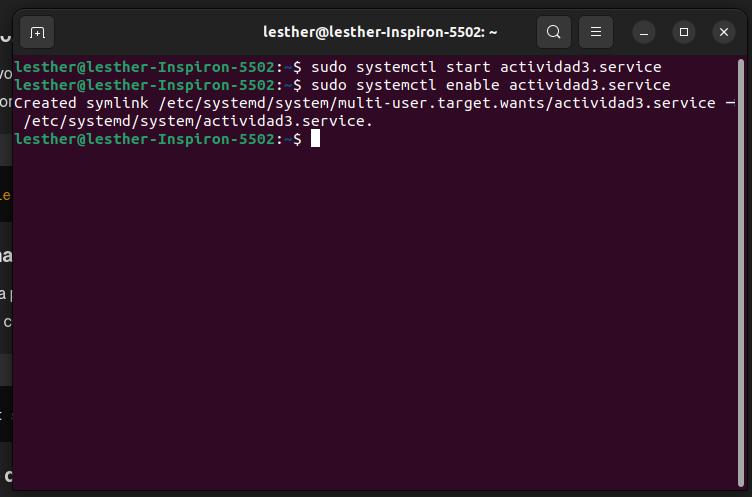

# Actividad 3 - Systemd Unit

## creacion script

En primera instancia se crea lo que es el script que imprime un saludo y la fecha actual de manera indefinida por medio de un while loop con una pausa de un segundo. La siguiente imagen muestra la estructura del srcipt creado.

 


## Serializacion de unit en un archivo

Lo siguiente en este proceso es la serialización de unit en un archivo, por lo que se procede a crear un archivo con la extension service en el directorio /etc/systemd/system. En este caso el archivo formado se le implementó el nombre 'actividad3'.

El contenido de actividad3 se presenta en la siguiente imagen.


 


## recargar archivos de configuracion de systemd

Posteriormente, se coloca en una terminal el comando con el proposito de recargar lo que son los archivos de configuracion del systemd, de este modo, el daemon de systemd reconocera los cambios ejecutados.

```cpp
sudo systemctl daemon-reload
```

## habilitar el servicio 

Se ejecuta un comando para la habilitacion del servicio, el cual tiene la siguiente estructura.

```cpp
sudo systemctl enable actividad3.service
```

Este comando habilita el servicio de actividad3 para que se inicie de manera automatica en cada reinicio del sistema.



## status

Por otro lado, es posible visualizar el estado del servicio con el siguiente comando.

```cpp
sudo systemctl status actividad3.service
```

## logs

Finalmente, para poder chequear los logs del servicio y con esto poder verificar el funcionamiento se hace uso del siguiente comando.

```cpp
journalctl -u actividad3.service

```


